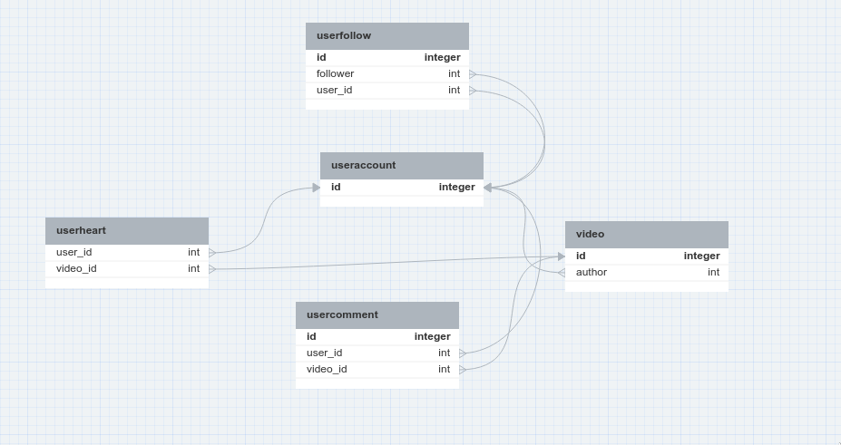

# Tiktok Clone API 
A tiktok backend for my clone tiktok app.
Frontend: https://github.com/khuongduy354/tiktok-clone 

# Features 
- Authentication/Authorization: bcrypt + JWT  
- CRUD videos  
- CRUS user profiles
- Like, Comment Videos
- Following users 
- Feed generation: all and only followers feeds 

# Tech Stack
- Cloudinary for cloud storage (images, videos)
- ElephantSQL for relational database (user, comment, video)   
- Knex.js for SQL query 
- Multer for file upload  
- Typescript   
- Deployed in vercel  
- Postman for API testing: [postman](TIktok.postman_collection.json)

# Database design  
Designed with [dbdesigner.net](https://erd.dbdesigner.net/) 

